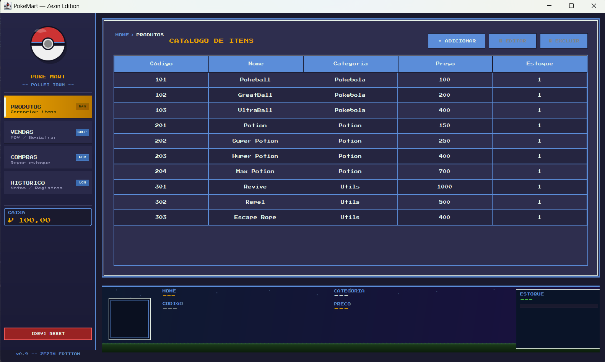
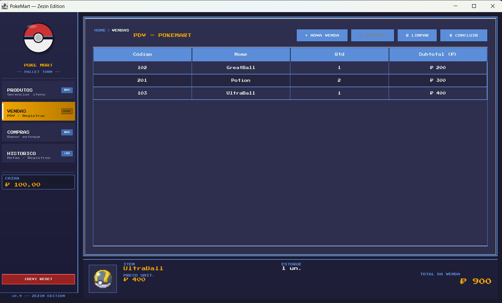
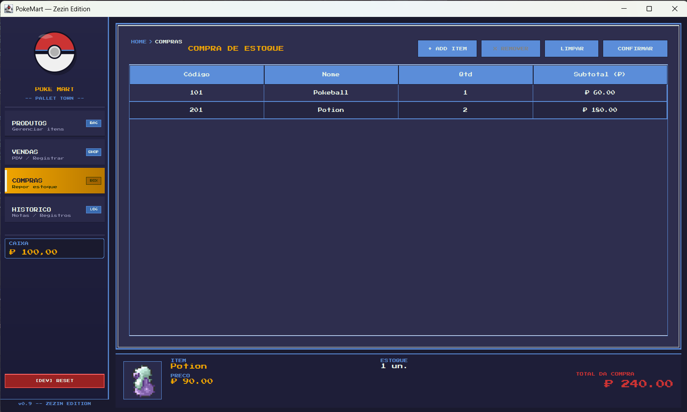
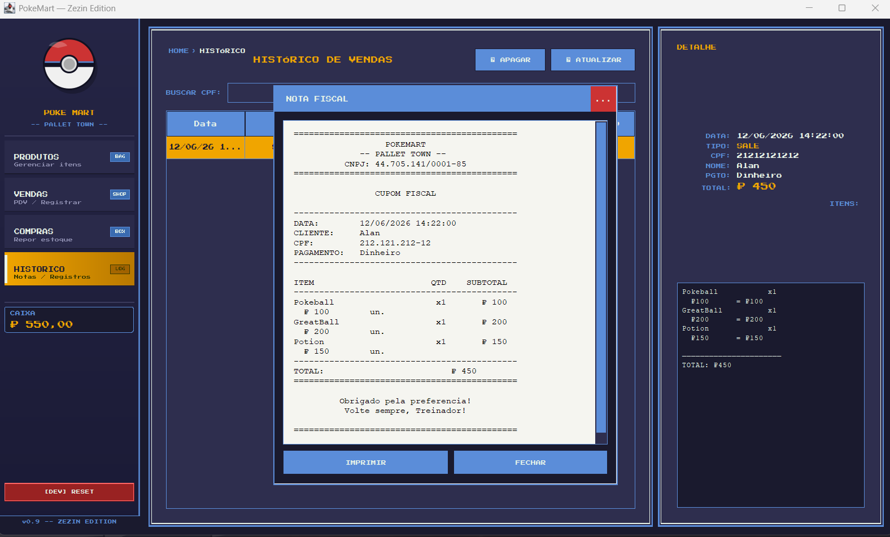

<div align="center">

```
PokeMart — Zezin Edition
```

[](https://www.oracle.com/java/)
[](https://maven.apache.org/)

</div>

---

```
+---------------------------------------------------+
|  SYSTEM REPORT          POKEMART@PALLET_TOWN      |
|  -------------------------------------------------|
|  App     : PokeMart — Zezin Edition               |
|  Platform: Java SE 21 + Swing                     |
|  Pattern : MVC + DAO + DTO                        |
|  DB      : JSON file-based (Gson)                 |
|  UI      : Custom Swing (pixel art / GBA theme)   |
|  Build   : Maven 3                                |
|  Libs    : Lombok 1.18 / MigLayout 11 / Gson 2.11 |
+---------------------------------------------------+
```

---

## Sobre

Sistema de gestão de loja desktop desenvolvido em Java SE com interface gráfica Swing, ambientado no universo Pokémon. Trabalho acadêmico para a disciplina de Programação Orientada a Objetos.

A loja se chama **PokeMart** — localizada em Pallet Town — e gerencia itens do universo Pokémon (Pokébolas, Poções, itens utilitários), vendas para treinadores e reposição de estoque.

---

## Screenshots

<div align="center">

| Catálogo de Itens | PDV — Vendas |
|:---:|:---:|
|  |  |

| Compra de Estoque | Histórico |
|:---:|:---:|
|  |  |

</div>

---

## Funcionalidades

**PRODUTOS** — CRUD completo de itens com imagem, código de barras, categoria e preço (limite ₽ 2.000)

**VENDAS (PDV)** — Registro de venda com busca por barcode ou catálogo clicável, validação de CPF, seleção de forma de pagamento e desconto de estoque em tempo real

**COMPRAS** — Reposição de estoque pela loja com preço de custo automático (60% do preço de venda) e desconto no caixa

**HISTÓRICO** — Registro completo de vendas e compras com busca por CPF, visualização de nota fiscal e impressão

**NOTA FISCAL** — Cupom em formato monospace com itens, quantidades, subtotais e total — imprimível via `PrinterJob`

**CAIXA** — Saldo persistido entre sessões (`cashier.json`), com limite máximo ₽ 999.999 e mínimo ₽ 0

---

## Arquitetura

| Camada | Responsabilidade |
|--------|-----------------|
| `view` | Telas Swing, dialogs, componentes customizados. Sem lógica de negócio |
| `controller` | Intermediário entre view e service. Orquestra o fluxo |
| `service` | Regras de negócio (validação de estoque, preço de custo, limites) |
| `repository` | Acesso aos arquivos JSON via `JsonFileRepositoryImpl` genérico |
| `entity` | POJOs com Lombok Builder: `Item`, `Sale`, `SaleHistoryEntry` |
| `dto` | Transferência de dados entre camadas sem expor entidades |
| `util` | `PokeTheme` (paleta + helpers visuais), `CpfValidator` |

---

## Persistência

Todos os dados são salvos em arquivos JSON no diretório `data/` na raiz do projeto:

```
data/
├── items.json       — catálogo de produtos
├── sales.json       — vendas concluídas
├── history.json     — histórico de operações (SALE / BUY)
├── cashier.json     — saldo do caixa
└── images/          — imagens dos itens
```

O diretório é resolvido automaticamente relativo ao `.jar` ou ao projeto, independente do Working Directory configurado na IDE.

---

## Stack

| Tecnologia | Versão | Uso |
|-----------|--------|-----|
| Java SE | 21 | Linguagem principal |
| Swing | — | Interface gráfica |
| Maven | 3 | Build e dependências |
| Lombok | 1.18.38 | Redução de boilerplate |
| Gson | 2.11.0 | Serialização JSON |
| MigLayout | 11.3 | Layout manager Swing |

---

## Como executar

**Pré-requisitos:** Java 21+, Maven 3

```bash
# Clonar o repositório
git clone https://github.com/jm-works/PokeMart-JAVA.git
cd PokeMart-JAVA

# Compilar e executar
mvn compile exec:java
```

Ou abrir no IntelliJ IDEA e rodar `Main.java` diretamente.

> **Importante:** o Working Directory deve ser a raiz do projeto para que o diretório `data/` seja encontrado corretamente.

---

## Domínio Pokémon

| Conceito real | Equivalente no sistema |
|--------------|----------------------|
| Cliente | Treinador (`customerName`, `customerCpf`) |
| Produto | Item (`Item` — Pokébola, Poção, etc.) |
| Moeda | PokéDollar (₽) |
| Venda | `Sale` + `SaleItem` |
| Compra | `completePurchase()` no `SaleService` |
| Nota fiscal | `ReceiptDialog` — cupom imprimível |

---

<div align="center">

```
+------------------------------------------+
|  PokeMart — Pallet Town  //  TP-02       |
|  Desenvolvido para fins academicos.      |
+------------------------------------------+
```

[JM | José Matheus](https://github.com/jm-works)

</div>